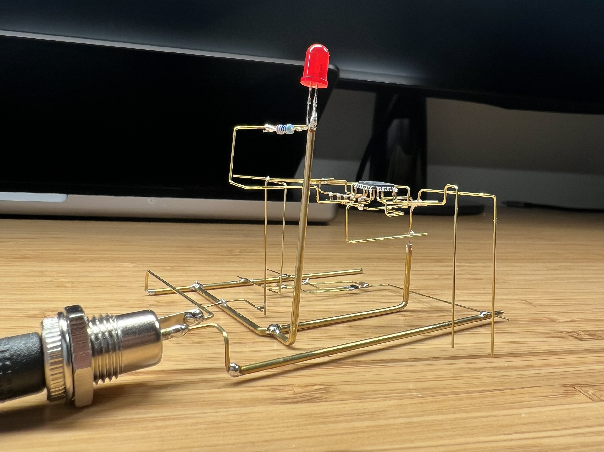
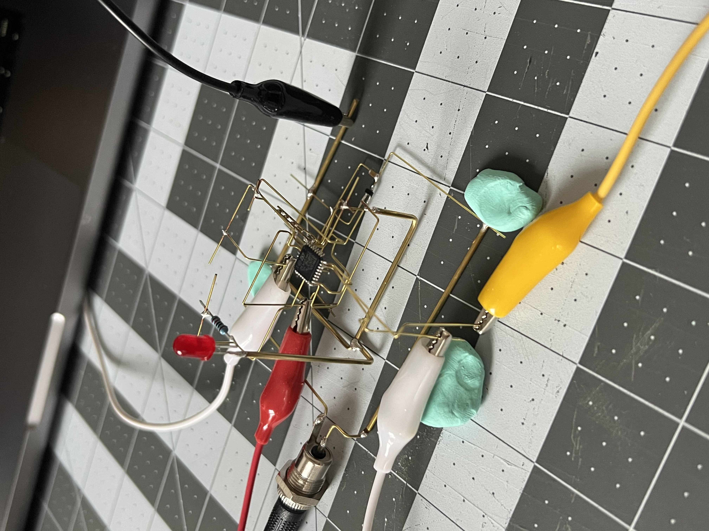
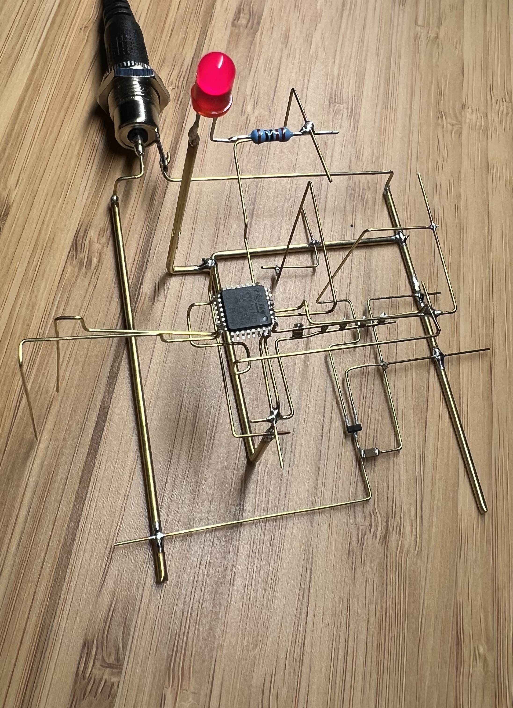

# Freeform Clock

This project was both an experiement and exercise in making something with parts I already had.
It uses an STM32 and one red LED that tells the time in morse code.

Even though it works as intended, it's not at all reliable as a clock. Due to the time consumption of
soldering everything in awkward positions, I skipped adding an external 32.768kHz crystal that would
ensure the RTC is accurate. During testing, I observed the duration of "one minute" is roughly 50 seconds.

The inspriation for this came from examples of freeform circuits that intrigued me, specifically the
works of [Eirik Brandal](https://eirikbrandal.com/) and [Mohit Bhoite](https://bhoite.com/).

This is the first one I've made, so it's a bit rough.

# Setting Time

The only method to set the time is to plug the clock in at midnight. When powered on, the RTC starts at `00:00` in 24 hour time format. There is no way to set the time once plugged in.

# Programming   

It is programmable via SWD and some alligator clips. I positioned several rods far out enough to be
able to carefully connect to and program the STM32. While this does work, it's quite delicate and very
easy to accidentially bend a rod out of place. Best not to do this often.

# Core Components

* [STM32](https://www.st.com/resource/en/datasheet/stm32l010f4.pdf)
* [3.3V voltage regulator](https://www.ti.com/lit/ds/symlink/tps7a05.pdf).
* DC Jack
* All necessary decoupling capacitors/etc that would be used in a practical PCB.
* Red LED
* 5V DC power supply (center positive) 

Everything is soldered together using K & S Precision Metals brass rods. A few different sizes were used.
The smallest size used was [0.51mm](https://ksmetals.com/products/brrmet-h), which was for soldering
directly to the pins of the STM32, as well as other small components. [0.81mm](https://ksmetals.com/products/brr-1-32) and [1.5mm](https://ksmetals.com/products/br225mm-1h) were used for power and ground rails, as well
as a rigid structure.

The very first thing you'll see ~1 minute after powering the clock, which translates to 12:01 a.m.

